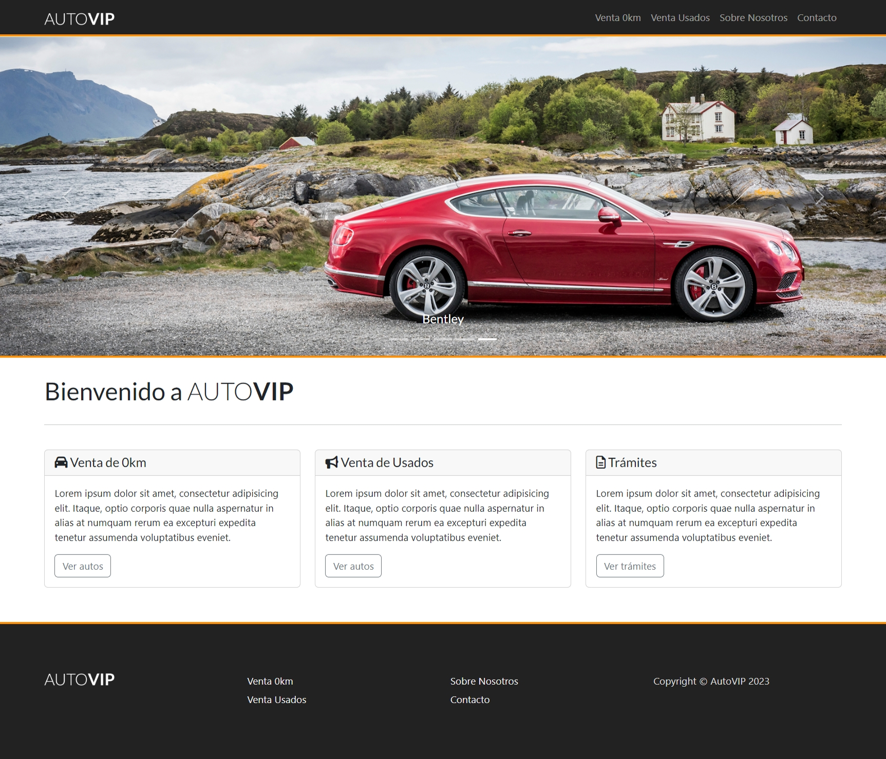

# 🚗 CarsAuto

**CarsAuto** es un sitio web estático diseñado para exhibir vehículos en venta. Ofrece una estructura moderna, limpia y responsiva, ideal como landing page para concesionarias, portafolios personales o proyectos académicos.

---

## 🖼️ Preview

---

## 🌐 Demo en vivo

Puedes ver el sitio en funcionamiento aquí:  
🔗 [https://carsauto.vercel.app/](https://carsauto.vercel.app/)

---

## 🧰 Tecnologías utilizadas

- **HTML5** — Estructura del contenido
- **CSS3** — Estilos personalizados y diseño responsive
- **JavaScript** — Funcionalidades básicas y manipulación del DOM
- **Fetch API** — Conexión dinámica con servicios externos

---

## ✨ Características

### Navegación Inteligente
- Sistema de navegación con estado activo persistente
- Resaltado visual del último enlace visitado
- Limpieza automática del estado al volver a la página principal
- Transiciones suaves entre estados

### Carga Dinámica
- Loader visual durante la carga de vehículos
- Feedback visual para el usuario durante operaciones asíncronas
- Transiciones suaves entre estados de carga

### Interfaz Responsiva
- Diseño adaptable a diferentes dispositivos
- Navegación intuitiva en móviles y tablets
- Experiencia de usuario optimizada

---

## Ejercicio propuesto por Hack Academy

